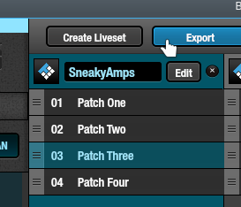
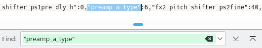
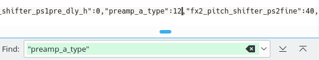
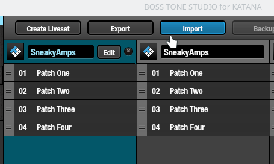
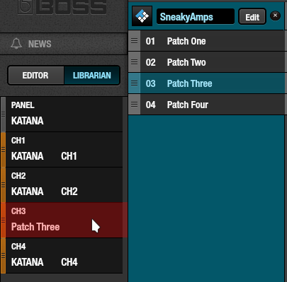

# How To: use 27 amp types.

**Tested on:** 
✓ Firmware `1.0.2` 
✓ Katana-100 Combo 

#### Contents

<!-- TOC depthFrom:2 depthTo:2 withLinks:1 updateOnSave:1 orderedList:0 -->

- [Introduction](#introduction)
- [Tone Studio and `.tsl` files](#tone-studio-and-tsl-files)
- [3rd party software](#3rd-party-software)
- [SysEx MIDI messages](#sysex-midi-messages)

<!-- /TOC -->

## Introduction

The Boss Katana amp, at the time of writing contains 27 amp types, of which only 5 are made available by default. These 27 amps appear to be the same as the Boss GT-100 pre-amps.

There's a few ways to select what I like to call **Sneaky Amps** and use them in your patches.

**Heads up!**
Different amp types have different output volumes, even with the same GAIN & VOLUME settings. Test out new settings at a lower MASTER volume to avoid sudden loud noises.

## Tone Studio and `.tsl` files

The `.tsl` files are JSON formatted livesets you can in/export in Boss Tone Studio for Katana. By editing these files, you are able to choose any of the 27 amp types.

**Export the Liveset you want to edit.**

> 

Note the position of the patch you want to edit. In our case it's the 3rd one.

**Open the file in a text editor**

Search for `"preamp_a_type"`, it should have the same number of matches as there are patches in this liveset. Cycle through them until you find the one you want to edit. In our case the 3rd.

> 

**Replace the number using the table**

Use the [Amp Type table](../tables/amp-types.md) to find the Sneaky Amp you want to use.

For example, perhaps you want the DELUXE CRUNCH. In the table this is listed as:

TSL | SysEx | GT-100 Name | Katana LED
:-:|:-:|-:|:-
12 | 0x0C | DELUXE CRUNCH | Crunch

The TSL number 12 is the one you want to use.

> 

**Save, import and drag**

> 

Importing your edited file will create a new entry in your librarian. The left one will be your edited version. Drag the edited patch "Patch Three" to any of your preset. For example CH3.

> 

Now whenever you select CH3 it should load your patch with the DELUXE CRUNCH amp.
And as the table indicates, the LED should light up at Crunch.

**Validating**

How do you know it's for real though?

Play some notes with your guitar on this setting. You will notice it's quite low-gain.

Now move the AMP TYPE knob to something else (CLEAN for example) and back to CRUNCH. This should revert the amp type back to the default (TWEED) which is much higher gain.

Switch between CH1 and CH3 so it loads your saved CH3. You will be back on the DELUXE CRUNCH.

## 3rd party software

Using 3rd party software should quickly become the easiest way to choose Sneaky Amps. So keep an eye on this. I will update the document when I see implementations.

[Submit an issue](https://github.com/katana-dev/docs/issues/new) if you know of software doing this.

## SysEx MIDI messages

This is a more advanced method, aimed at 3rd party software developers and knowledgeable hackers.

In this [Reverse Engineered SysEx specification by Steven Hirsch](https://github.com/snhirsch/katana-midi-bridge/blob/master/doc/katana_sysex.txt) you can find how to construct SysEx MIDI messages for the Katanas, along with python code that does so.

There are two addresses associated with the amp type you can write to over SysEx. Either address immediately switches the amp type of whichever TONE SETTING you are currently on (CH1-4 or PANEL).

### Default Amps `0x00 0x00 0x04 0x20`

This is what Tone Studio uses to write to and corresponds to the knob on your amp.

It's values are: 
`0x00` Acoustic 
`0x01` Clean 
`0x02` Crunch 
`0x03` Lead 
`0x04` Brown 

### Sneaky Amps `0x60 0x00 0x00 0x51`

This is the address that takes the GT-100's values for pre-amps.
It's values are between `0x00` and `0x1B`.
You can find the full list in the SysEx column of the [Amp Type table](../tables/amp-types.md).